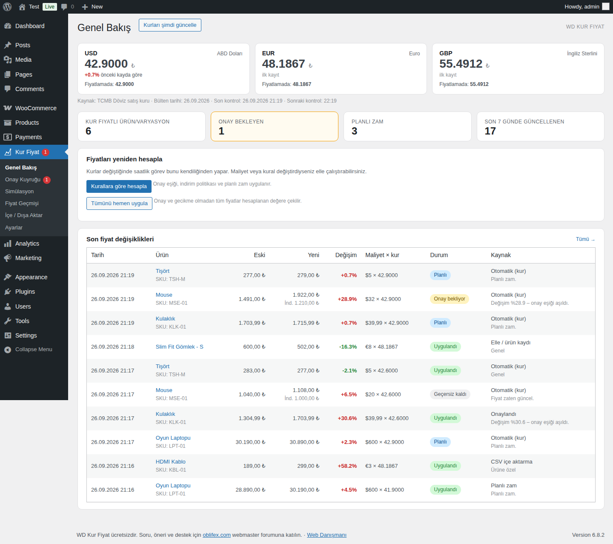
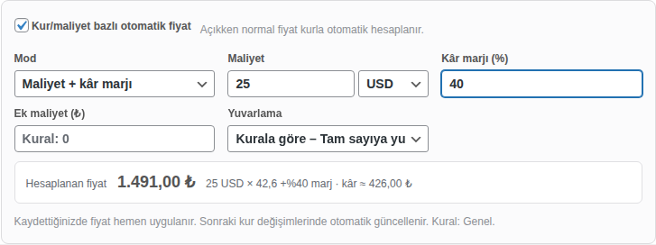
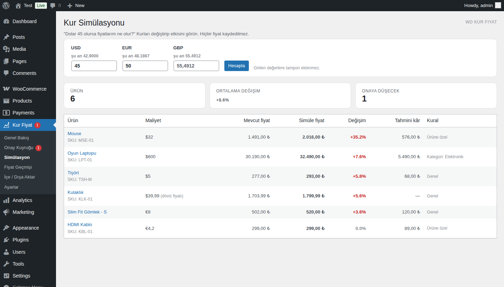
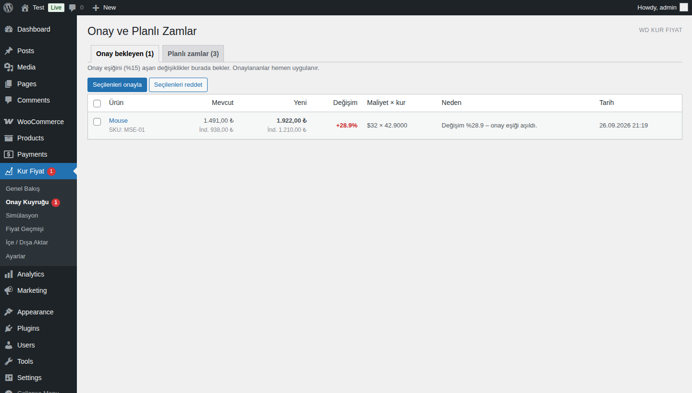
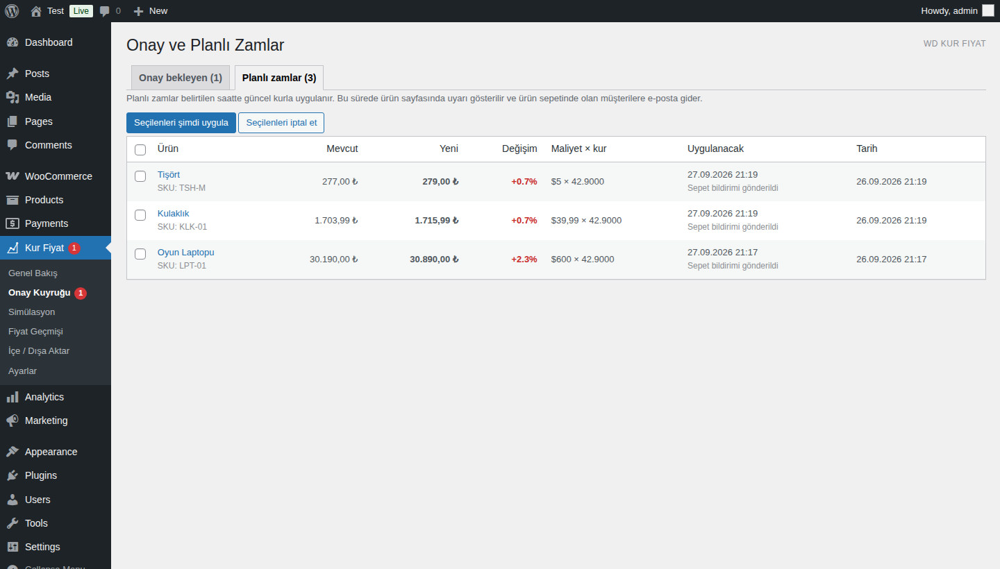
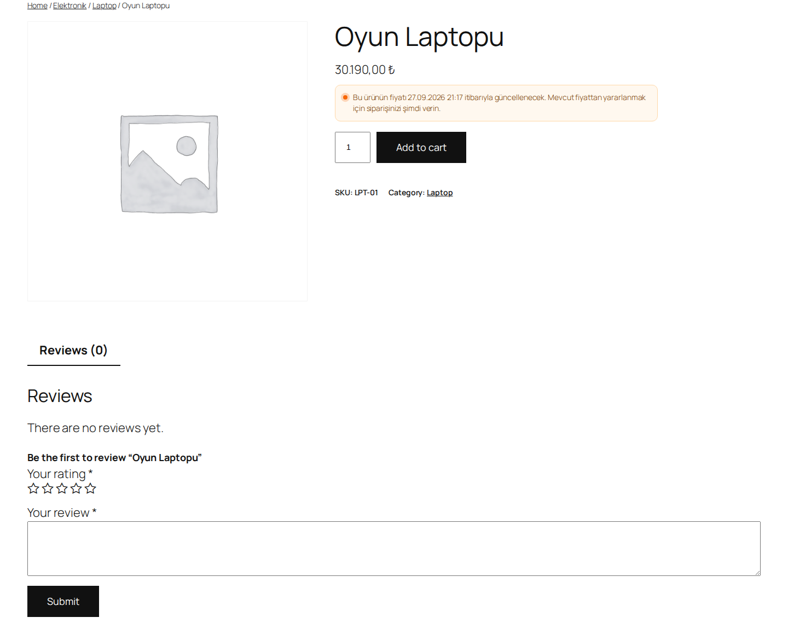

<div align="center">

# 💱 WD Kur Fiyat

**Kur/maliyet bazlı otomatik fiyatlama (WooCommerce için)**

Maliyeti dolar, euro veya sterlin olarak girin. Fiyatlar TCMB kuruna, kâr marjınıza ve yuvarlama kurallarınıza göre kendiliğinden güncellensin.

[](https://wordpress.org)
[](https://woocommerce.com)
[](https://php.net)
[](#)
[](LICENSE)
[](#)

### 💬 Destek, soru ve öneriler: **[oblifex.com](https://oblifex.com)**
Türkiye'nin webmaster forumu: WordPress, WooCommerce, sunucu, SEO ve e-ticaret üzerine konuşuyoruz.

</div>

---

## Neden bu eklenti?

İthal ürün satan her mağaza aynı döngüyü yaşar: kur hareketlenir, yüzlerce ürünün fiyatı tek tek güncellenir. Geç kalınırsa zararına satılır, erken ya da yanlış yapılırsa müşteri kaçar.

**WD Kur Fiyat** bu işi otomatiğe bağlar ve yanlış bir kur verisinin bütün mağazanın fiyatını bozmasına karşı güvenlik katmanları ekler:

```
fiyat = yuvarla( ( maliyet × kur + ek maliyet ) × (1 + kâr marjı) × (1 + KDV) )
```

## Ekran görüntüleri

| Genel bakış | Ürün düzenleme |
|---|---|
|  |  |

| Kur simülasyonu | Onay kuyruğu |
|---|---|
|  |  |

| Planlı zamlar | Ürün sayfası uyarısı |
|---|---|
|  |  |

## Özellikler

### 💱 Kur
- **TCMB kurları:** Saatlik kontrol edilir. Döviz satış, döviz alış, efektif satış veya efektif alış kuru seçilebilir.
- **Desteklenen para birimleri:** USD, EUR, GBP, CHF, JPY, CNY, CAD, AUD, SAR, AED ve diğerleri. JPY gibi 100 birimle yayımlanan kurlar otomatik bölünür.
- **Kur tamponu:** Kura yüzde olarak güvenlik payı eklenebilir (örneğin +%1).
- **Elle kur:** İstenen para biriminde TCMB yerine tedarikçinizin kuru kullanılabilir.
- **Kur geçmişi:** Kurlar yalnızca değiştiklerinde kaydedilir.

### 🏷️ Fiyatlama
- **İki mod:** Maliyet + kâr marjı veya doğrudan döviz satış fiyatı (örneğin "29,99 $").
- **Kural önceliği:** Ürüne özel marj → kategori kuralı → genel ayar. Alt kategoriler üst kategorinin kuralını devralır.
- **Ek maliyet ve KDV:** Kargo veya gümrük gibi sabit ek maliyet ve KDV ekleme seçeneği.
- **10 yuvarlama kuralı:** Tam sayı, sonu 9, sonu 90, sonu 99, kuruşu ,99, 5/10/50/100'ün katı. Yuvarlama hep **yukarı** yapılır; fiyat asla hesaplanandan düşük olmaz.
- **İndirimli fiyat:** Ürünün indirimli fiyatı da aynı oranda ölçeklenir.
- **Varyasyon desteği:** Her varyasyonun ayrı maliyeti ve para birimi olabilir.
- **Canlı önizleme:** Ürün düzenleme ekranında hesaplanan fiyat ve tahmini kâr anında görünür.

### 🛡️ Güvenlik
- **Kur sıçrama koruması:** Kur, son uygulanandan örneğin %5'ten fazla saparsa o para birimindeki tüm otomatik güncellemeler durur. Siz tek tıkla onaylayana kadar fiyatlar değişmez. Hatalı veya anormal veriye karşı korur.
- **Onay eşiği:** Tek seferde örneğin %15'ten fazla değişen fiyatlar uygulanmaz, onay kuyruğuna düşer.
- **İndirim politikası:** Kur düşünce fiyat da düşsün, yalnızca %X'in üzerindeki düşüşlerde düşsün ya da hiç düşmesin.
- **Simülasyon:** "Dolar 45 olursa fiyatlarım ne olur?" sorusunun cevabını hiçbir fiyatı değiştirmeden görün.

### 📣 Planlı zam
- **Gecikmeli zam:** Zamları örneğin 24 saat sonra uygulayabilirsiniz. İndirimler her zaman hemen uygulanır.
- **Ürün sayfası uyarısı:** Bu süre boyunca "Bu ürünün fiyatı … itibarıyla güncellenecek" bilgisi gösterilir.
- **Sepet bildirimi:** Ürünü sepetinde bekleten üyelere zam öncesi e-posta gider.

### 📋 Yönetim
- **Fiyat geçmişi:** Her değişiklik eski ve yeni fiyat, kur, maliyet ve kaynağıyla (otomatik, onay, planlı, CSV, elle) saklanır.
- **CSV içe/dışa aktarma:** Şablonu indirip Excel'de maliyetleri doldurun, geri yükleyin. Eşleştirme SKU ile yapılır.
- **Ürün listesi:** "Kur fiyat" sütununda maliyet, marj ve onay/planlı durumu görünür.
- **Büyük kataloglar:** 150'den fazla ürün WooCommerce Action Scheduler ile arka planda 50'lik parçalar halinde işlenir.
- **Para birimi biçimi:** Tutarlar WooCommerce ayarlarınızdaki biçimle yazılır (örneğin `1.491,00 ₺`).

## Kurulum

1. [Releases](../../releases) sayfasından `wd-kur-fiyat.zip` dosyasını indirin.
2. WordPress panelinde **Eklentiler > Yeni Ekle > Eklenti Yükle** ile zip'i yükleyip etkinleştirin.
3. **Kur Fiyat > Ayarlar** ekranında para birimlerini, varsayılan marjı, yuvarlamayı ve güvenlik eşiklerini belirleyin.
4. **Kur Fiyat > Genel Bakış** ekranında **Kurları şimdi güncelle** düğmesine basın.
5. Maliyetleri girin:
   - Ürün düzenleme ekranındaki **Kur/maliyet bazlı otomatik fiyat** kutusundan, ya da
   - **İçe / Dışa Aktar** ekranından CSV ile toplu olarak.

> ⚠️ İlk kurulumda toplu fiyat uygulamadan önce **Simülasyon** ekranında sonuçları kontrol etmeniz önerilir.

## Gereksinimler

- WordPress 6.0+
- WooCommerce 7.0+ (HPOS açık veya kapalı)
- PHP 7.4+ (PHP 8.4 ile test edildi)
- Sunucunun `www.tcmb.gov.tr` adresine erişebilmesi. Erişemiyorsa elle kur kullanılabilir.
- WP-Cron'un çalışması. Trafiği düşük sitelerde gerçek cron önerilir: `*/15 * * * * wget -q -O - https://siteniz.com/wp-cron.php`

## Geliştiriciler için

| Kanca | Tür | Açıklama |
|---|---|---|
| `wdkf_tcmb_url` | filter | Kur kaynağı adresi (farklı veya yedek kaynak için) |
| `wdkf_notify_user_ids` | filter | Planlı zamda bildirim alacak kullanıcılar (örneğin favori listesi eklentisi ile) |
| `wdkf_price_applied` | action | Bir ürüne yeni fiyat yazıldığında |

Veriler `{prefix}wdkf_rates` (kur geçmişi) ve `{prefix}wdkf_changes` (fiyat geçmişi ve kuyruk) tablolarında tutulur. Ürün ayarları `_wdkf_*` meta alanlarındadır.

## Destek ve katkı

- 💬 **Soru, hata bildirimi ve öneriler:** [oblifex.com](https://oblifex.com). Forumda konu açın, hem biz hem diğer webmasterlar yardımcı olur.
- 🐛 Hata bildirimi için GitHub [Issues](../../issues) da kullanılabilir.
- 🔧 Pull request'lere açığız.

Eklentiyi faydalı bulduysanız repoya ⭐ vermeniz ve [oblifex.com](https://oblifex.com)'da deneyiminizi paylaşmanız en büyük destektir.

## Lisans

[GPLv2 veya üzeri](LICENSE). Ücretsizdir; dilediğiniz gibi kullanabilir, değiştirebilir ve dağıtabilirsiniz.

---

<div align="center">

**[Web Danışmanı](https://webdanismani.com)** tarafından geliştirildi · Topluluk: **[oblifex.com](https://oblifex.com)**

</div>
